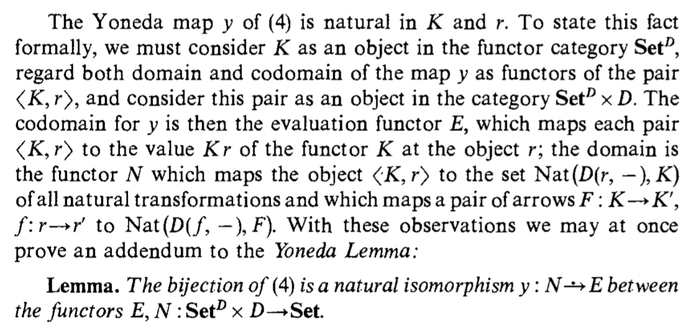

## Yoneda Embedding

### Category theory study group
### Amsterdam 2019

<script src="http://ajax.googleapis.com/ajax/libs/jquery/1.9.1/jquery.min.js"></script>

*** For text alignment check the following
*** https://github.com/hakimel/reveal.js/issues/1897
*** https://stackoverflow.com/questions/21019476/how-can-i-get-left-justified-paragraphs-in-reveal-js?utm_medium=organic&utm_source=google_rich_qa&utm_campaign=google_rich_qa

This is the title page.


--- &vertical

## Yoneda Lemma

<div style='text-align: center;'>
    
</div>

***

## Natural Isomorphism


<div style='text-align: center;'>
    
</div>


***

## Proof In Haskell

```haskell
isoLeft :: (Functor f) => (forall x. (a -> x) -> f x) -> f a
isoLeft nt = nt id

isoRight :: (Functor f) => f a -> (forall x. (a -> x) -> f x)
isoRight fa g = fmap g fa
```

--- &vertical

### (Co)Yoneda Embedding

<div style='text-align: center;'>
    
</div>

***

### In Haskell

``` haskell

arrowMap :: (b -> a) -> (forall x. (a -> x) -> (b -> x))
arrowMap f g = g . f

```


--- &vertical

### Challenge 1

Express the co-Yoneda embedding in Haskell.


#### Solution

```haskell
arrowMap :: (a -> b) -> (forall x. (x -> a) -> (x -> b))
arrowMap f g = f . g
```

--- &vertical

### Challenge 2

Show that the bijection we established between fromY and btoa is an isomorphism (the two mappings are the inverse of each other).

--- &vertical

### Challenge 3

Work out the Yoneda embedding for a monoid. What functor corresponds to the monoid's single object? What natural transformations correspond to monoid morphisms?


--- &vertical

### Challenge 4

What is the application of the covariant Yoneda embedding to preorders? (Question suggested by Gershom Bazerman.)


#### Solution
$a \leq b$ if and only if $\forall x, b \leq x \Rightarrow a\leq x$


--- &vertical

### Challenge 5
Yoneda embedding can be used to embed an arbitrary functor category [C, D] in the functor category [[C, D], Set]. Figure out how it works on morphisms (which in this case are natural transformations).

---

# Thank you! 


